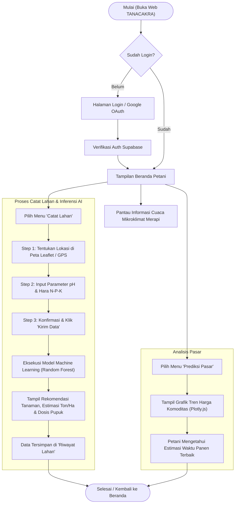
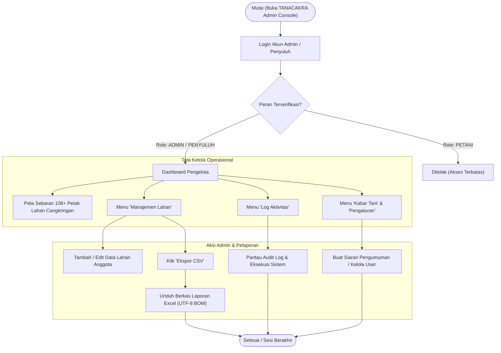
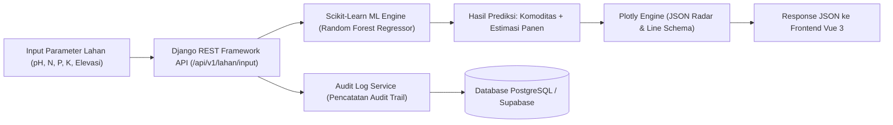

<div align="center">

  

  # TANACAKRA — Sistem Presisi Pertanian Lereng Merapi

  **Platform Manajemen Lahan, Prediksi Pasar, & Rekomendasi Komoditas Berbasis Machine Learning untuk Kelompok Tani Desa Cangkringan, Sleman, DIY.**

  [](https://vuejs.org/)
  [](https://www.typescriptlang.org/)
  [](https://tailwindcss.com/)
  [](https://www.django-rest-framework.org/)
  [](https://scikit-learn.org/)
  [](https://supabase.com/)
  [](https://tanacakra.vercel.app)

</div>

---

## 🌾 Tentang Tanacakra

**TANACAKRA** adalah platform digital *greenfield modular* yang dirancang untuk memberdayakan kelompok tani lokal di area **Kapanewon Cangkringan, Kabupaten Sleman, Yogyakarta** (Wukirsari, Argomulyo, Glagaharjo, Kepuharjo, dan Umbulharjo).

Mengombinasikan analisis hara tanah Regosol Vulkanik lereng Gunung Merapi dengan **Random Forest Machine Learning Engine**, Tanacakra memberikan rekomendasi tanam presisi, estimasi hasil panen (ton/ha), prediksi tren harga pasar komoditas, serta integrasi pemantauan cuaca mikroklimat secara *real-time*.

---

## ✨ Fitur-Fitur Utama

- 🤖 **Engine ML Scikit-Learn (Random Forest)**: Memprediksi kesuburan tanah (pH, N-P-K, kelembapan, elevasi) dan merekomendasikan komoditas pertanian ideal (Padi Rojolele, Cabai Merah, Salak Pondoh, Bawang Merah, Jagung, dll).
- 📊 **Visualisasi Interaktif Plotly.js**: Grafik tren harga pasar dinamis, perbandingan volume panen, dan diagram radar keseimbangan hara tanah.
- 🗺️ **Pemetaan Interaktif Leaflet**: Klasterisasi 108 petak lahan pertanian Cangkringan dengan indikator status kesehatan tanah (Subur vs Perlu Atensi).
- 🔒 **Sistem Akses Terkontrol (RBAC)**: Pembatasan hak akses berjenjang berbasis Supabase Auth & Django REST permissions:
  - **ADMIN / KELOMPOK TANI**: Akses penuh tata kelola lahan, konfigurasi parameter ML, audit log, dan ekspor data.
  - **PENYULUH LAPANGAN**: Akses operasional pendampingan petani & pencatatan sampel tanah.
  - **PETANI**: Akses mandiri catat lahan, lihat hasil rekomendasi AI, & pantau tren pasar komoditas.
- 📰 **Warta & Kabar Tani**: Agregasi informasi berita pertanian Cangkringan dan siaran otomatis rekomendasi cuaca BMKG.
- 📥 **Ekspor Data Excel (CSV UTF-8 BOM)**: Fitur unduh data lahan dan log aktivitas terformat rapi (`sep=,`) yang kompatibel langsung dengan Microsoft Excel.

---

## 🔄 Alur Kerja Sistem (System Workflow)

### 🌾 1. Alur Pengguna (Petani)



### 👨‍💼 2. Alur Pengelola (Admin / Penyuluh)



### ⚡ 3. Pemrosesan Data & Machine Learning Engine



---

## 🛠️ Arsitektur & Teknologi

Sistem Tanacakra dibangun secara *decoupled* (Frontend & Backend terpisah sepenuhnya):

```
                       ┌───────────────────────────────────────┐
                       │           VUE 3 FRONTEND              │
                       │ (Vite + TypeScript + Tailwind CSS)    │
                       └──────────────────┬────────────────────┘
                                          │
                                   RESTful JSON API
                                          │
                       ┌──────────────────┴────────────────────┐
                       │           DJANGO REST BACKEND         │
                       │    (Python REST API Engine)           │
                       └──────────┬──────────────────┬─────────┘
                                  │                  │
                ┌─────────────────┴─┐              ┌─┴──────────────────┐
                │   Scikit-Learn    │              │  PostgreSQL        │
                │ Machine Learning  │              │  (Supabase BAAS)   │
                └───────────────────┘              └────────────────────┘
```

| Layer | Teknologi Utama |
|---|---|
| **Frontend UI/UX** | Vue 3 (Composition API), TypeScript, Vite, Tailwind CSS |
| **Peta & Grafik** | Leaflet.js, Leaflet.markercluster, Plotly.js |
| **Backend REST API** | Django 5.x, Django REST Framework |
| **Machine Learning** | Scikit-learn (Random Forest Regressor & Classifier), Pandas, NumPy |
| **Database & Auth** | PostgreSQL via Supabase (BAAS), Supabase Auth |
| **Deployment** | Vercel (Frontend SPA), Render / Railway (Backend API) |

---

## 🚀 Panduan Memulai (Quick Start)

### Prasyarat
- **Node.js** >= 18.x & **npm** >= 9.x
- **Python** >= 3.10 & **pip**

### 1. Cloning Repositori
```bash
git clone https://github.com/Nklasyfa/TANACAKRA.git
cd TANACAKRA
```

### 2. Memulai Frontend (Vue 3)
```bash
cd frontend
npm install
npm run dev
```
Aplikasi frontend akan berjalan di `http://localhost:5173`.

### 3. Memulai Backend (Django REST)
```bash
cd ../backend
python -m venv venv
# Windows:
venv\Scripts\activate
# Linux/macOS:
source venv/bin/activate

pip install -r requirements.txt
python manage.py migrate
python manage.py runserver
```
API backend akan berjalan di `http://127.0.0.1:8000/api/v1/`.

---

## 📋 Ringkasan API Endpoints Utama

| Method | Endpoint | Deskripsi | Akses |
|---|---|---|---|
| `POST` | `/api/v1/auth/login` | Login user & dapatkan token DRF | Publik |
| `GET` | `/api/v1/lahan` | Mengambil seluruh data petak lahan Cangkringan | Authenticated |
| `POST` | `/api/v1/lahan/<id>/input` | Input telemetri tanah & jalankan inferensi ML | PETANI / ADMIN |
| `GET` | `/api/v1/dashboard/trends` | Mengambil agregat statistik & skema Plotly | Authenticated |
| `GET` | `/api/v1/audit-logs` | Mengambil riwayat log audit aktivitas sistem | ADMIN / PENYULUH |

---

## 👥 Tim Pengembang (Tanacakra Team)

- **Syafa (Nklasyfa)** — *Lead Software Engineer & Frontend Architect*
- **Tia** — *Project Manager*
- **Shoffie** — *Data Analyst & ML Specialist*
- **Nakula** — *Software Programmer*
- **VINIX7** — *Mitra Training & Development Partner*

---

## 📄 Lisensi & Hak Cipta

© 2026 **TANACAKRA Team & Kelompok Tani Desa Cangkringan, Sleman, DIY**. Hak cipta dilindungi undang-undang.
